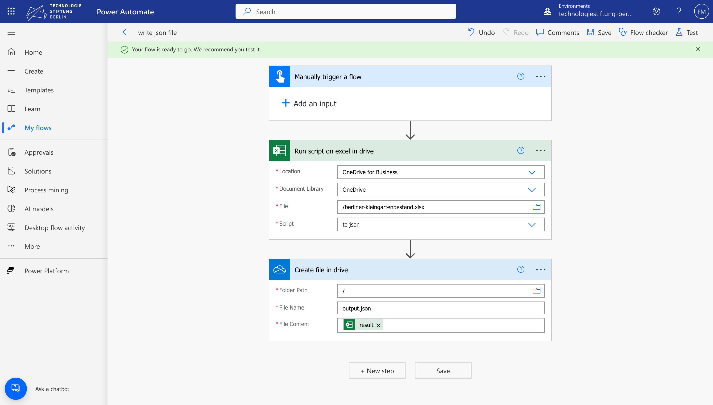

# Office Script

In a nutshell it is JavaScript/TypeScript that you can use to automate task in Excel. You can do things like `fetch`[^1], `async/await` and many other modern JS features. It is unclear which TypeScript and EcmaScript versions are used and also which runtime is used.

Still you can do many useful things with it. This write down is not a documentation on how to write scripts. It is more a loose collection of findings around it.

To start writing scripts take a look into the [documentation](https://learn.microsoft.com/en-us/office/dev/scripts/) and specially into the [API reference](https://learn.microsoft.com/en-us/javascript/api/office-scripts/overview?view=office-scripts)

## The Editor

To get started writing scripts go to the ribbon tab "Automate". You can

- inspect some built in scripts,
- create an empty one
- or record some actions you do in the UI.

When you create a new script the editor will open on the side. This is a reduced VSCode built into Excel. It has autocomplete, shows you errors based on typings, has a mini map, and gives you what you are used when writing scripts using TypeScript. There some restrictions you can read about [here](https://learn.microsoft.com/en-us/office/dev/scripts/develop/typescript-restrictions).

Unfortunately there is no formatter built in so write tidy code.

Make sure to save your scripts regularly. You can attach a script to a workbook or save it on your drive in the cloud. Having them in the cloud males the available in all your workbooks.

## Running Scripts

You can run scripts from the UI elements in the Automate ribbon tab by clicking on them or while editing them.

### Power Automate

Another way to run scripts is using [power automate](https://learn.microsoft.com/en-us/power-automate/). This allows you to create flows that run scripts. To pass data into and out of scripts in power automate you need to edit the signature of your main function.

For example this is a function that can accept a value from a previous step and pass its result to the next one. Power automate uses the function signature to make the result of your function available to the next step. So make sure to type your functions right.

```ts
interface Result {
	foo: string;
}
function main(workbook: ExcelScript.Workbook, input: unknown): Result {
	return { foo: "bah" };
}
```

Another thing to note is that in power automate you can't use scripting Excel APIs like `workbook.getActiveWorksheet();` nor can you do HTTP requests from a script. There is a step type HTTP but it is locked behind another premium subscription. You could try to incorporate other services to send data over http. For example is there a GitHub repository dispatch step which allows passing a payload to an GitHub action.

Below you see a screenshot of a simple flow that runs a script and saves the result into a file.



## Data I/O

The most interesting thing here that you can do HTTP requests from within Excel. Use `fetch` to send data to external services. It seems that you can't make requests to `localhost`. This opens possibilities to NOT have Excel as the database but to have Excel as window into the database. Combined with some restrictions in the file what can and what can't be edited this is a way to work with Excel as a frontend.

## Findings

### Tables in Excel

Yeah sounds wired. This is a feature I never encountered in Excel spreadsheets I got. It is called a [table](https://support.microsoft.com/en-gb/office/overview-of-excel-tables-7ab0bb7d-3a9e-4b56-a3c9-6c94334e492c).

So by definition you normally don't work with tables. You just work with a range of cells.

Tables allow you

- better filtering
- sorting
- better reference of columns in formulas

e.g. This is a formula that sums the columns units * price in the table "SalesData" `=SUM(SalesData[Units]*SalesData[Price])`

## Examples

A script to export a table to json.

```typescript
interface TableData {
	bezirk: string;

	anlagen: string;

	parzellen: string;

	flaeche_in_ha: string;
}
function main(workbook: ExcelScript.Workbook): TableData[] {
	const sheet = workbook.getActiveWorksheet();

	const tables = sheet.getTables();
	if (tables[0]) {
		const table = tables[0];
		const texts = table.getRange().getTexts();
		console.log(texts);
		const keys = texts[0].map((item) =>
			item.toLowerCase().replace(/\s/g, "_").replace(/[Ää]/gi, "ae"),
		);
		const data: TableData[] = texts.slice(1).map((row, index, arr) => {
			const item = {} as TableData;
			for (let i = 0; i < keys.length; i++) {
				item[keys[i]] = row[i];
			}
			return item;
		});
		console.log(data);
		return data;
	}
}
```

This is the table.

| Bezirk                     | Anlagen | Parzellen | Fläche in ha | Foo  |
| -------------------------- | ------- | --------- | ------------ | ---- |
| Mitte                      | 29      | 1984      | 65,7         | TRUE |
| Friedrichshain-Kreuzberg   | 4       | 228       | 7            | TRUE |
| Pankow                     | 91      | 10167     | 477,5        | TRUE |
| Charlottenburg-Wilmersdorf | 108     | 8044      | 279,9        | TRUE |
| Spandau                    | 73      | 4333      | 184,7        | TRUE |
| Steglitz-Zehlendorf        | 70      | 5311      | 192,2        | TRUE |
| Tempelhof-Schöneberg       | 90      | 6613      | 224,9        | TRUE |
| Neukölln                   | 87      | 9397      | 388,8        | TRUE |
| Treptow-Köpenick           | 146     | 9004      | 400,3        | TRUE |
| Marzahn-Hellersdorf        | 37      | 3215      | 152          | TRUE |
| Lichtenberg                | 55      | 5965      | 271,8        | TRUE |
| Reinickendorf              | 80      | 6395      | 248,7        | TRUE |
| Berlin                     | 870     | 70656     | 2893,5       | TRUE |

[^1]: You can't talk to localhost though
